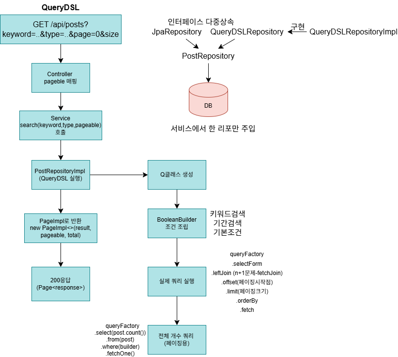
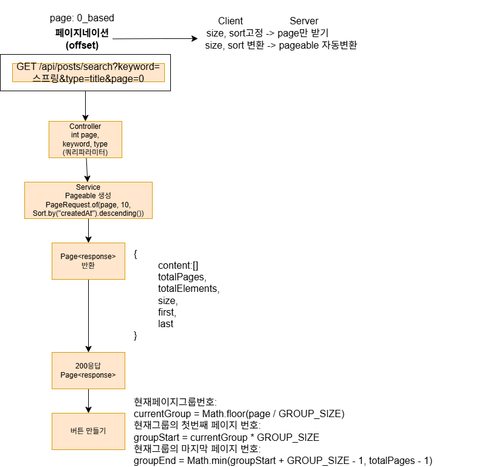
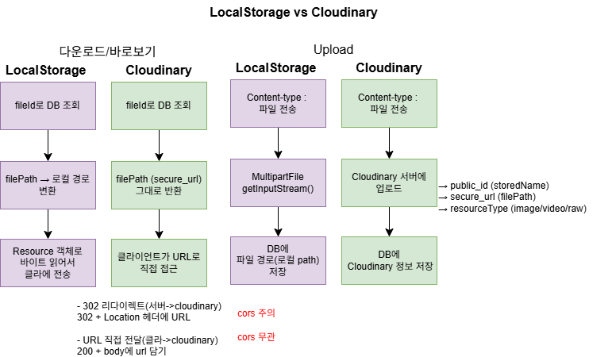
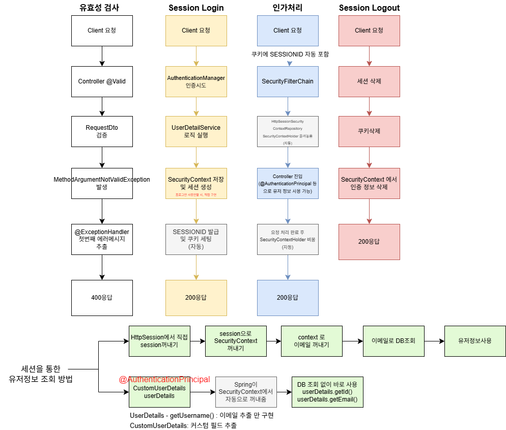

# 게시판 CRUD 구현 정리

---
## 흐름도

- **QueryDSL**

  

---

- **페이지네이션 offset**

  

---

- **파일저장소**

  

---

- **session 로그인 + 유효성검사(@Valid)**

 

---
## 1. 기능 목록

| 도메인 | 기능 |
|--------|------|
| 게시글 | 목록 조회 (페이징), 상세 조회, 작성, 수정, 삭제, 제목/내용 검색 (QueryDSL) |
| 파일 | 업로드, 다운로드, 삭제 |
| 댓글 | 목록 조회, 작성, 수정, 삭제, 작성자 표시 + 작성 시간 |
| 공통 | 작성일/수정일 자동 기록 (BaseEntity), 조회수 증가 |

---

## 2. 삭제 전략

| 도메인 | 방식 | 이유 |
|--------|------|------|
| 게시글 | 소프트 딜리트 | 댓글 등 연관 데이터 보존 |
| 댓글 | 소프트 딜리트 | 게시글과 동일 |
| 파일 | 하드 딜리트 | 실제 파일도 함께 삭제, 용량 관리 |

**소프트 딜리트 구현 방법**
- `BaseEntity`에 `deletedAt` 컬럼 추가
- `@SQLDelete`로 DELETE 쿼리를 UPDATE로 오버라이드
- `@Where(clause = "deleted_at is null")`로 조회 시 자동 필터링

---

## 3. 커스텀 어노테이션 기반 비밀번호 유효성 검사

**구현 이유**
> @Pattern을 써도되지만 나중에 비밀번호 변경같은 기능을 추가 고려

**구현 방법**
- @ValidPassword 어노테이션 생성
- ConstraintValidator 구현체에서 정책 검사 로직 작성
- @Valid와 동일하게 사용 가능

**검증 레이어**
| 레이어 | 방법 |
|--------|------|
| 서버 | @ValidPassword 커스텀 어노테이션 |
| 클라 | 실시간 유효성 검사 |

**추가
서비스레이어에서 유연하게 유효성검사를 하는 방법도 있다고 함 추가공부필요

---

## 4. 파일 업로드 구조 설계

> 유지보수 목적 — 인터페이스로 추상화 후 구현체 교체 방식

| 구분 | 설명 |
|------|------|
| `FileStorageService` (interface) | 업로드/다운로드/삭제 추상화 |
| `LocalFileStorageService` (구현체) | 개발 테스트용 저장 |
| `CloudinaryFileStorageService` (구현체) | 클라우디너리 외부저장소 저장 |
| `S3FileStorageService` (구현체) | 추후 S3로 교체 시 구현체만 변경 |

**저장소별 다운로드 방식 차이**

| 저장소 | 방식 |
|--------|------|
| Cloudinary, S3 | URL로 브라우저에서 직접 접근 |
| 로컬 | 서버에서 파일을 직접 읽어 바이너리로 변환 후 전송 |

로컬 저장소는 외부에서 직접 접근이 불가능해서 서버를 거쳐야 하므로
Cloudinary, S3 대비 로직이 복잡하고 서버 부하가 발생함

---

## 5. 페이지네이션 방식

> 스프링의 Pagable 라이브러리를 이용하여 mysql_limit 기반으로 개발

# 추가 공부 정리

- 세션의 장점 -> 서버에서 세션 관리
- 강제로그아웃 - 관리자가 서버에서 세션삭제 - 즉시만료
- 중복로그인 - maximumsession(1) - 기존 세션 자동 만료

